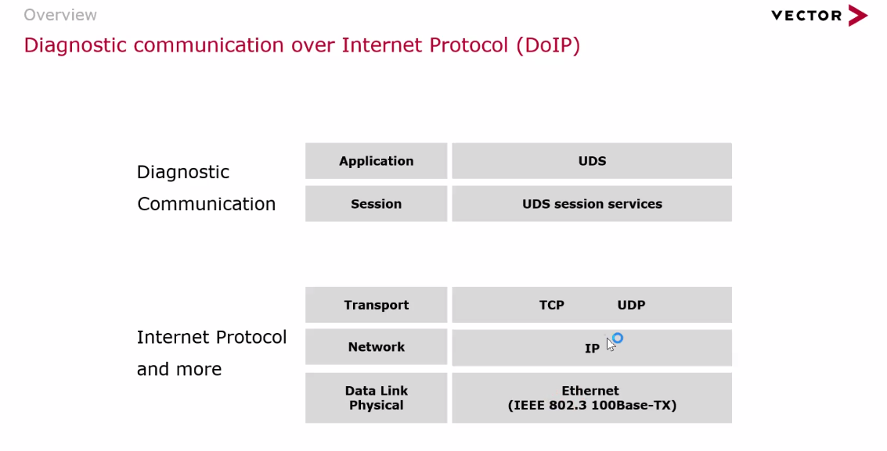
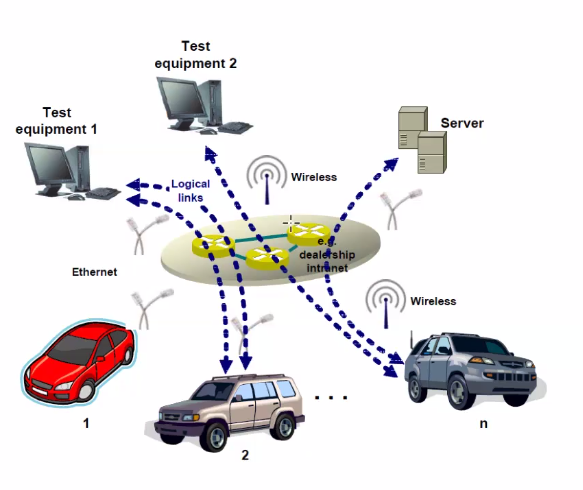
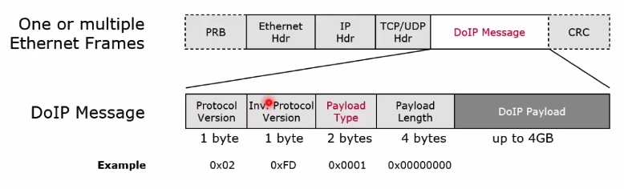
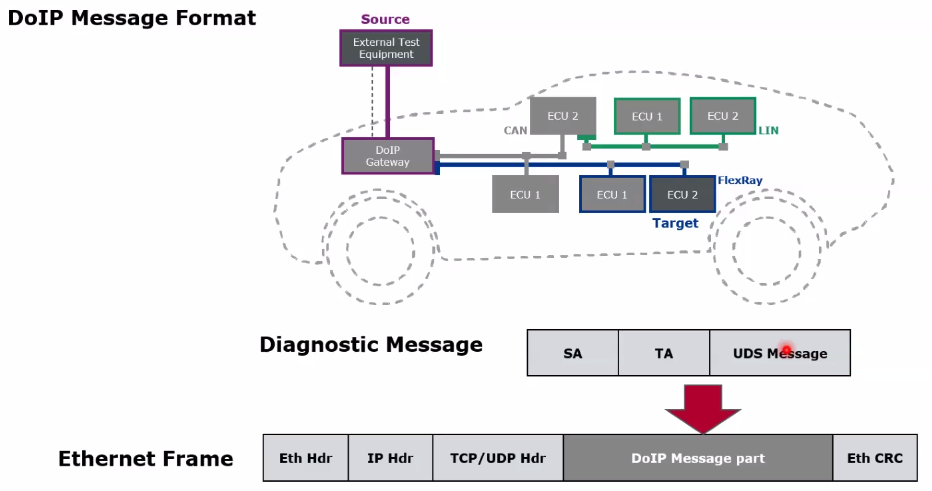
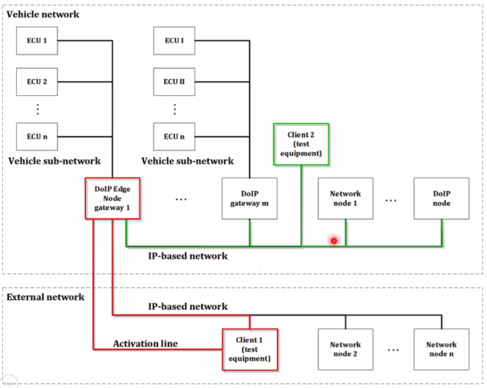
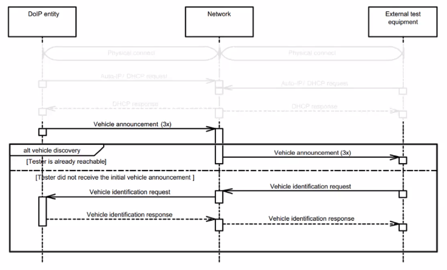
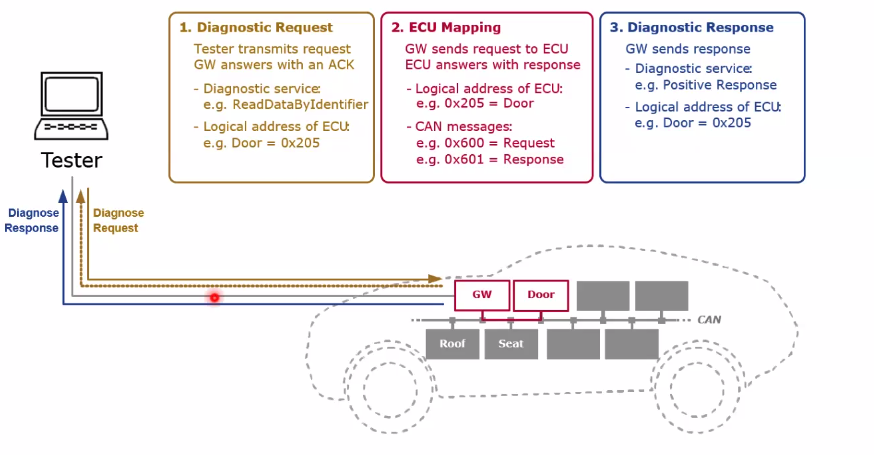
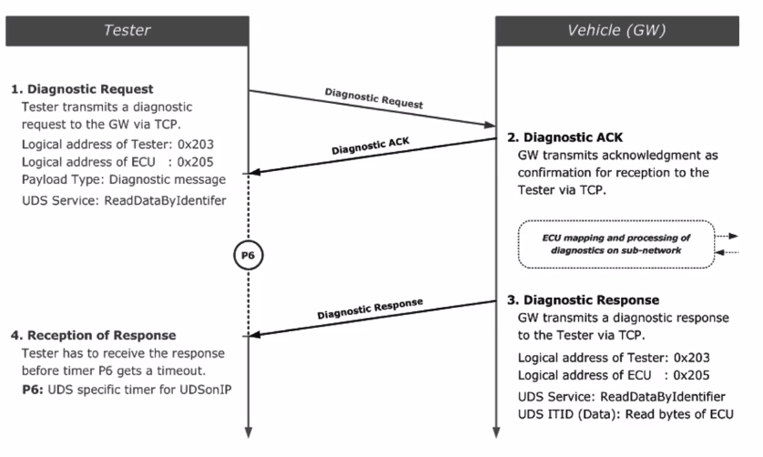

# DoIP

## Overview

What is DoIP?

Where is DoIP used?

## Session manage

- Network connection
  - Network
  - Connector
  - Activation Line
  - IP Address Assignment
- Vehcile Discovery
  - VIN
  - EID: mac address
  - GID: group of EID
  - LA: logical address (2bytes)
- Connection Establishment
  - TCP connection
- Diagnostic Communication

## Message format

- Ox0001: Vehicle identification request without EID or VIN
- 0x0002: Vehicle identification request with EID
- 0x0003: Vehicle identification request with VIN
- 0x0004: Vehicle announcement/vehicle identification response
- 0x0005: Routing activation request
- 0x0006: Routing activation response
- 0x0007: Alive check request
- 0x0008: Alive check response
- 0x4001: DIP entity status request
- 0x4002: DoIP entity status response
- 0x4003: Diagnostic power mode information request
- 0x4004: Diagnostic power mode information response
- 0x8001: Diagnostic message
- 0x8002: Diagnostic message positive acknowledge (only for DoIP, not related with UDS)
- 0x8003: Diagnostic message negative acknowledge (only for DoIP, not related with UDS)

DoIP Payload

e.g. External Test Equipment (LA 0x0E00) and ECU (LA 0x0302)

| Type     | Sender LA | Receive LA | UDS |
| -------- | --------- | ---------- | --- |
| request  | 0x0E00    | 0x0302     | --- |
| response | 0x0302    | 0x0E00     | --- |

## Network

### Network topology

According to ISO 13400-2:2019

### Activation Line

- Reduction of electromagnetic interference
- Reduction of power consumption of the DIP Edge Node

  - when Activation Line has high voltage, DoIP Edge Node is activate

很多做法是在 OBD 口，将激活线的 PIN 角和 Kl.30 的引脚直接上拉处理。这样当插上 OBD 口时，激活线默认是上拉的。对于车内节点的 DoIP 通信，一般是不需要物理激活线的，比如通过 NM 唤醒激活 DoIP。

## Vehicle Discovery

VIN - Vehicle Identification Number
EID - Entity Identifier

- DIP Entity: node or gateway that implements the DoIP-protocol
- Unique ID of a DIP entity (e.g. MAC address)

LA - Logical Address

- Address of diagnostic request / response

GID - Group Identifier

- Unique ID of a group of DoIP entities within the same vehicle
- Used instead of VIN in order to associate newly installed and un-configured DoIP entities with a vehicle
- For example: VIN/GID masters MAC address

### Sequence Diagram

### Vehcile Announcement

UDP, Multicast, Destination Port 12400, payload type 0x0004

payload: VIN, LA, EID, GID, ...

### Vehicle Identification Request And Response

Requset:
UDP, Multicast / Unicast, destination port: 13400

Response:
UDP, Unicast, destination port: Request source port

## Connection Establishment

TCP:

- port 13400

TLS:

- port 3490

Alive Check:

- TCP, Mandatory
- Used by DoIP entity to check the aliveness of TCP socket
- Used by Test Equipment to keep a currently idle connection alive

## Disanostic Communication

Diagnostic Communication Sequence

- DiagnosticSessionControl (0x10)
  - Possible loss of TCP connection due to a session change
  - The tester shall establish a new TCP connection and routing activation for diagnostic communication
  - Positive response can be sent before closing TCP connection or after reconnection. (IS014229-5:2022)
- EcuReset (Ox11)
  - Loss of TCP connection due to ECU reset
  - The tester shall establish a new TCP connection and routing activation for diagnostic communication
  - Positive response shall be sent before closing the TCP connection
- ReadDataByPeriodicIdentifier (0x2A)
  - Additional logical address for periodic data response messages
