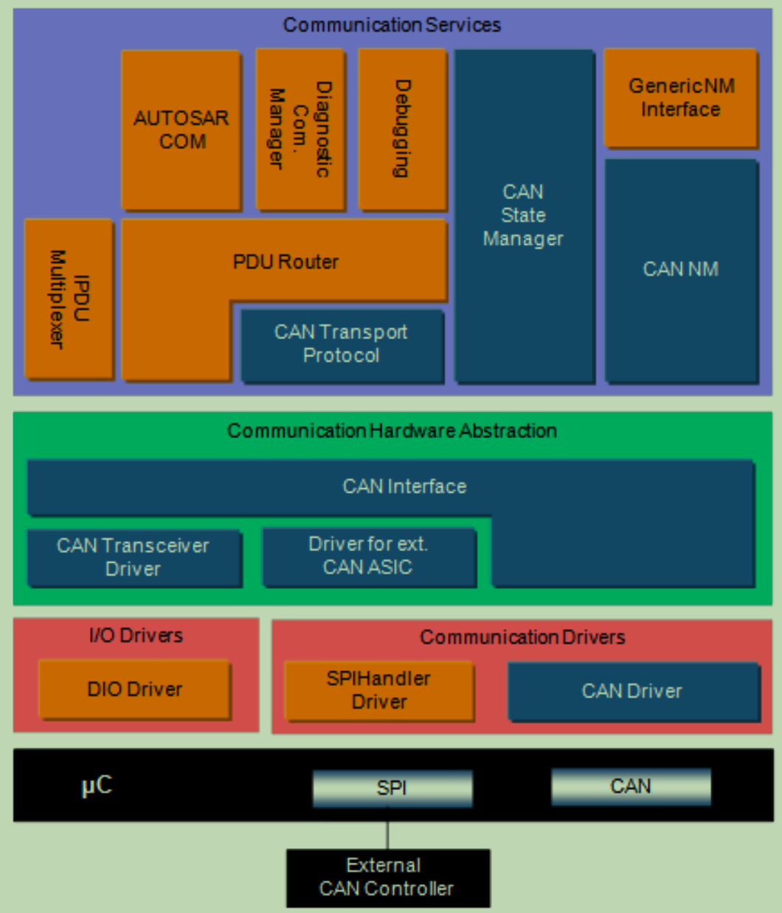

### CAN 的种类

- 高速 CAN（ISO11898）1Mbd
- 低速 CAN（ISO11519）125kBd
- CANFD：与高速 CAN 相同，但速率更高
- 部分 CAN 硬件支持电源管理，可以配置不同的唤醒/睡眠模式从而降低功耗
  - 唤醒模式
    - 总线
    - 内部
    - Sleep: The transceiver is in operation mode sleep and no wakeup has been occurred.
- 部分硬件支持 advanced limp home handling
  - limp home mode 是指车辆检测到可能有害的故障时进入的模式，不会关闭发动机，仅允许小心的“跛行回家”
- 部分 system basis chips（SBC）支持多路 CAN 总线收发，watchdog，电压整形等功能
  - SBC 具有大量分属不同 AUTOSAR 模块的功能，且由于共享内存等问题，无法拆分，必须使用一个**定制**的驱动对整个 domain 进行管理

### CAN 协议栈架构

### CAN 驱动

- L-PDU 的硬件支持过滤器应指初始化阶段进行配置（仅在 STOPPED 模式下可以重新配置），配置参数可在预编译/链接/构建后确定
  - 降低软件负载
- CAN 控制器事件处理
  - Polling：CAN 驱动使用周期 Task 对 CAN 控制器进行轮询
  - Interrupt 中断
- CAN 驱动应支持硬件时间戳（CIA 603），可通过时间同步协议增加全局时间精度
- 初始化：初始化模块全局变量，CAN hardware Unit 和 CAN Control 寄存器
- 正常操作
  - 开/关 CAN 控制器中断
  - 数据一致性（老报文读取时不会被新报文覆盖）
  - 数据接受完成时，CAN 驱动通过 CAN Interface 中静态配置的回调函数通知 CAN Interface
  - CAN 驱动提供 API 用于发送 L-PDU（由 CAN Interface 调用）
  - 数据发送完成时，CAN 驱动通过 CAN Interface 中静态配置的回调函数通知 CAN Interface
- CAN 驱动模式
  - uninit
  - stopped
  - started
  - sleep
    - wakeup interrupt 会调用 StateManager 中静态配置的回调函数
- 关闭操作
- 失效操作：关闭 CAN bus，通过静态配置的函数通知 CAN Interface

### CAN Interface

- CAN communication matrix => 静态配置在 CAN Interface 中
- 提供软件过滤器，过滤所有未被硬件过滤器过滤但又不在可接收的 L-PDU 清单中的 PDU（可在预编译&链接&构建后配置）
  - 被过滤的 PDU 不会通知上层协议栈
- DLC（Data Length Code） check 需要被静态配置
- 初始化
  - 支持从配置集中选择静态配置
- 正常操作

  - 开/关 CAN 控制器中所有 L-PDU 的接收
  - 负责 PDU 的分发，并通知上层协议栈。通知中包含 L-PDU 的标识信息，但在通知执行过程中不进行数据的传输和处理。

    > The CAN Interface knows which upper layer is the addressee of a successfully received L-PDU and makes a decision to which layer it belongs. That's why the CAN Interface can redirect sequential L-PDU to its destination
    > The CAN driver will indicate each successfully received L-PDU. The appropriate higher communication stack shall be notified by the CAN Interface about an occurred reception. This routing of an indication event is the task of the CAN Interface. An indication is only a notification, where no data is transferred. The information which L-PDU has been received shall be part of the indication

  - 负责分发需要发送的 CAN 信号给对应的 CAN 控制器（ECU 中包含多个 CAN 控制器）
  - 提供发送服务，L-PDU 会转发给 CAN 驱动或者储存在 Tx Buffer 中
  - CAN 驱动确认发送完成后，需要分发给对应的上层协议栈传输成功的通知。该分发表需要为每个 PDU 静态配置
  - 切换 CAN 控制器模式（见 CAN 驱动部分）
  - 查询 CAN 控制器模式
  - 查询 CAN 唤醒源
  - 提供动态 TX Handles 用于修改 ID 和 DLC，可用于 CAN-TP 协议
  - 提供动态 RX Handles 用于访问 ID 和 DLC，可用于 CAN-TP 协议
  - 提供一个轮询接口，上层协议栈可用于轮询报文的通知状态
    - 轮询模式和回调模式应该互相兼容
    - 轮询模式需要有一个 API 用于读取 CAN 报文
      - 从 CAN 硬件 Buffer 读取
      - 从 CAN 驱动 shadow buffer 读取
  - Tx 过滤器
    - 当 L-PDU 被激活用于传输，Tx 过滤器切换到 blocking 模式
    - blocking 模式，除了 Wakeup Frame（WUF）以外的的所有 PDU 会被丢弃
    - 当收到 WUF 发送通知后，Tx 过滤器切换到 pass 模式
    - pass 模式所有 L-PDU 会被转发到下一层
    - Tx 过滤器在 Bus-Off 模式下不启用

- 关闭操作
- 失效操作
  - 报告 bus-off 状态

### CAN 状态管理

- Bus-Off 的恢复时间
