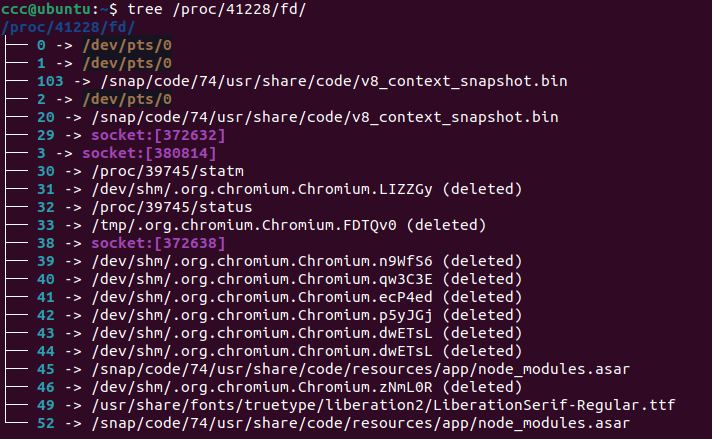
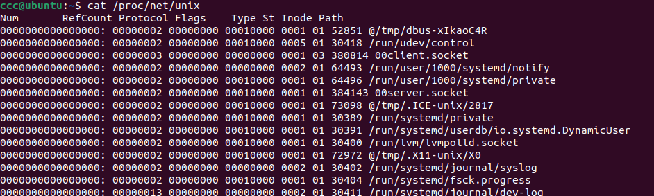

# Unix Domain Socket

## How to create unix domain socket

```cpp
// service
#include <sys/socket.h>
#include <sys/un.h>
#include <unistd.h>

char socket_path[] = "\00server.socket"; // \00 means is abstract socket, file socket use a file path
// char socket_path[] = "server.socket"; need unlink after usage!

struct sockaddr_un service_un;
memset(&service_un, 0, sizeof(service_un));
service_un.sun_family = AF_UNIX;
memcpy(service_un.sun_path, socket_path,sizeof(socket_path));
const int len = offsetof(struct sockaddr_un, sun_path) + sizeof(socket_path);

int listenfd = socket(AF_UNIX, SOCK_STREAM, 0);
bind(listenfd, (struct sockaddr *)&service_un, len);
listen(listenfd, 20);

int connfd = accept(listenfd, (struct sockaddr *)&cliun, &cliun_len);
```

```cpp
// service
#include <sys/socket.h>
#include <sys/un.h>
#include <unistd.h>

char client_path[] = "\00client.socket";
char server_path[] = "\00server.socket";

struct sockaddr_un client_un;
memset(&client_un, 0, sizeof(client_un));
client_un.sun_family = AF_UNIX;
memcpy(client_un.sun_path, client_path, sizeof(client_path));
const int client_un_len = offsetof(struct sockaddr_un, sun_path) + sizeof(client_path);

struct sockaddr_un service_un;
memset(&service_un, 0, sizeof(service_un));
service_un.sun_family = AF_UNIX;
memcpy(service_un.sun_path, server_path, sizeof(server_path));
const int service_un_len = offsetof(struct sockaddr_un, sun_path) + sizeof(server_path);

int sockfd = socket(AF_UNIX, SOCK_STREAM, 0);
bind(sockfd, (struct sockaddr *)&client_un, client_un_len);
connect(sockfd, (struct sockaddr *)&service_un, service_un_len);

// write(sockfd, buf, strlen(buf));
// read(sockfd, buf, MAXLINE);
```

## show information

### command

```bash
lsof -U   # unix domain socket
ss -x     # pear between socket
```

### file

- in `/proc/$pid/fd/` we can find the file descriptor and it linked source file.



```c
// read fd linked socket in c
int get_fd_file_name(int fd, char *file_name, size_t len) {
  const int BUF_SIZE = 1024;
  char buf[BUF_SIZE];
  memset(buf, 0, BUF_SIZE);
  snprintf(buf, BUF_SIZE, "/proc/self/fd/%d", fd);
  memset(file_name, 0, len);
  return readlink(buf, file_name, BUF_SIZE);
}
```

- in `/proc/net/unix` we can find the information about unix domain socket (by the wey, similar file path for tcp udp and so on)

  we can read this file and get the socket path

  

## How to listen unix domain socket

### socat

貌似需要在 service 启动, 但 client 未连接时候替换 domain socket 文件, 同时启动一个 proxy domain socket

### Ring-3 hook - 通过动态库优先加载机制劫持函数

涉及环境变量

```bash
export LD_PRELOAD=<path_to_hook.so>
```

example

```c
// hook.c
#include <dlfcn.h>
#include <stdlib.h>
#include <sys/socket.h>
#include <sys/types.h>
#include <unistd.h>

typedef int (*CONNECT)(int sockfd, const struct sockaddr *addr,
                       socklen_t addrlen);

int connect(int sockfd, const struct sockaddr *addr, socklen_t addrlen) {
  void *handle = NULL;
  CONNECT old_connect = NULL;
  handle = dlopen("libc.so.6", RTLD_LAZY);
  old_connect = (CONNECT)dlsym(handle, "connect");
  return old_connect(sockfd, addr, addrlen);
}
```

compiler

```bash
gcc -fPIC -shared -o hook.so hook.c -ldl
```

## More

Netfilter linux 自带模块, 提供网络通讯的 hook 点 : https://zhuanlan.zhihu.com/p/61164326

winsock : http://www.360doc.com/content/14/1009/17/2206512_415569413.shtml
