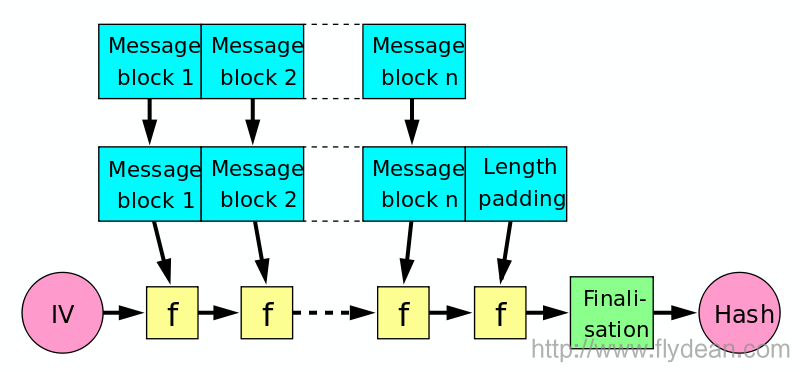
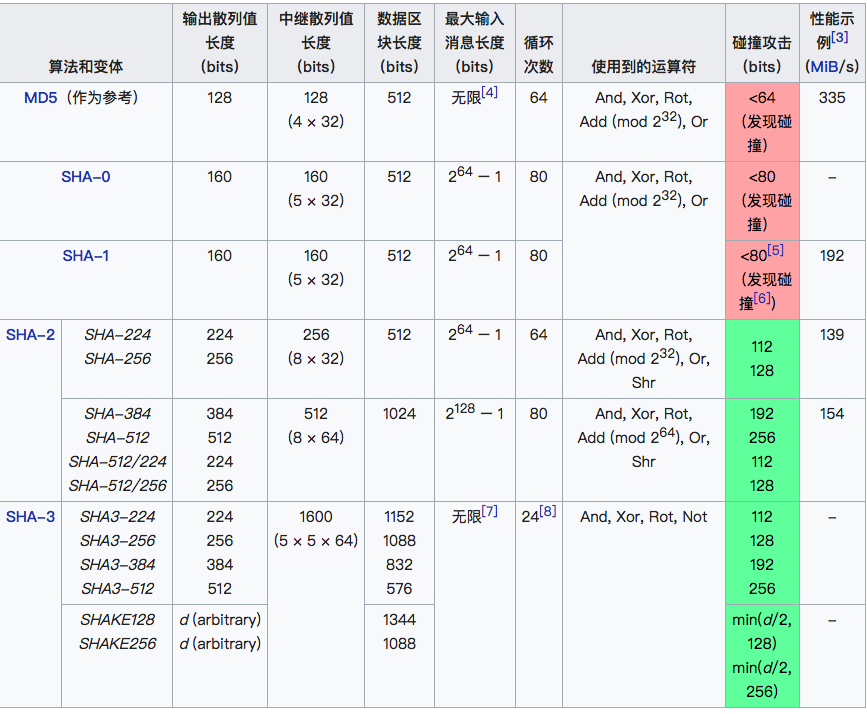
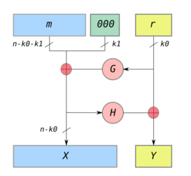

# 密码学

两方在使用不可靠信道进行数据交互时，发送方需要使用加密算法进行数据加密后发送，而接收方需要使用对应的解密算法进行解密。通常，在发送数据前，发送方接收方需要通过某种协议首先进行加解密算法密钥的同步。

### 数据加密算法

对称算法 - 加密解密过程可逆，即使用 ABC 进行加密，使用 CBA 进行解密

- DES（已废弃）：分组加密，密钥长度 56 位
- 3DES ：替换 DES 的暂时性方案，随着运算性能的增加，DES 的密钥长度不足以满足安全性要求，因此使用三组不同的 DES 密钥对数据进行三次加密
  - 临时方案，可以复用 DES 的硬件，减少成本
  - 为什么不是两组？可以使用空间换时间的方案，从头尾两端同时进行解密，对中间结果建立 hashmap
- AES（推荐）：对称分组密码体系，密钥长度可选 128 位，192 位，256 位，分组长度为 128 位

### 密钥交换相关算法

建立可信通路前，通过密钥交换算法交换密钥，可以动态的协商加密解密的密钥，避免本地储存过多密钥。

- RSA（PKCS#1）：基于两个大素数的乘积难以因式分解，因此可以将乘积公开作为加密密钥。RSA 需要
  - 素数 p，q，$n = pq$ ,   $\phi(n)=pq$
  - 找到整数 e，与$\phi (n) $ 互斥；取d，使得 $de \ mod \ \phi (n) = 1$
  - 公开模值 n（1024/2048/...位），公钥 e （通常为 65537）
  - $ cipher = text^e \ mod \ n$
  - $ text = cipher^d \ mod \ n$
  - 原理：欧拉定理：设 m 是大于 1 的整数，如果 a ，m 互质，则：$ a^{\phi (m)} = 1 (mod \ m)$
- ECC（PKCS#13）：利用椭圆曲线的性质
  - 选定椭圆曲线 E，确定基点 G
  - 根据私钥 p，生成公钥 K=pG
  - 公开 E，G，K
  - [ECC 原理（非欧几何，阿贝尔群）](https://www.cnblogs.com/Kalafinaian/p/7392505.html)
- Diffie-Hellman（PKCS#3）：
  - 公开素数 p 和素数的本原根 g
  - A 生成随机数 a，公开$g^a \ mod \ p = Y_a$；B 生成 b，公开$Y_b$
  - 公共密钥 $K = {Y_a}^b \ mod \ p = {Y_b}^a \ mod \ p$

### 摘要算法

- Merkle-Damgard 结构: 消息被分成了很多个 block，最开始的初始化向量和第一个 block 进行 f 操作，得到了的结果再和第二个 block 进行操作，如此循环进行，最终得到了最后的结果

  

- MD-5
- SHA-1
- SHA-224, SHA-255, SHA-384, SHA-512
- 

### 填充算法

在分组密码 / 定长加密算法中，如 RSA，AES 中，若数据不足分组长度，需要将数据填补至指定长度

- ZeroPadding：补 0，无法区分数据尾部 0
- PKCS7Padding（多用于对称加密）：补 n 个字节，值为 n， `n = len % block_size;n = n==0?block_size:n;`
- PKCS#1_v1.5（用于 RSA）：00 02 [a bunch of non-zero random bytes] 00 [the message]，随机数长度 = 公钥位数 - 明文位数 - 3 \* 8，且大于等于 8 字节，因此使用该 padding 算法的 RSA 明文长度最多为公钥位数-11bytes
- PKCS#1_v2 / OAEP（用于 RSA）：引入了随机数和校验
  - 生成一个 k0 位的随机数 r
  - 原文 m 补上 k1 位 0，得到消息 M， k1 = n - size(m) - k0
  - 对 r 取 hash 获得 G(r)
  - 补位后的消息 M 与 G(r)进行异或操作，得到 X
  - 然后随机数 r 与 X 的 hash 值进行异或操作，得到 Y
  - 将 X 与 Y 合并成补位后的消息
  - 
